# Домашнее задание к занятию 1 «Введение в Ansible»

---

## Подготовка

Ansible установлен на macOS. Для тестов подняты 2 LXC контейнера на Proxmox:
- **210** (ansible-test-1): 192.168.1.68
- **211** (ansible-test-2): 192.168.1.71

Доступ через SSH с мака через ProxyJump (pve 192.168.1.83).

---

## Задание 1

Запустил playbook на test.yml:
```bash
ansible-playbook -i inventory/test.yml site.yml
```

Значение `some_fact` для localhost: **12**

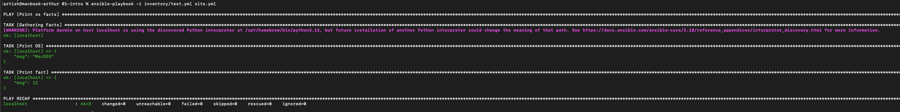

---

## Задание 2

Нашёл переменную в `group_vars/all/examp.yml`, поменял значение с `12` на `"all default fact"`.

После изменения playbook выводит новое значение:

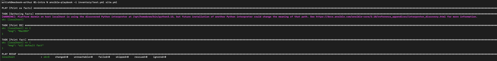

---

## Задание 3

Создал `inventory/prod.yml` с двумя группами (deb и el) для контейнеров в Proxmox. Проверил подключение:
```bash
ansible -i inventory/prod.yml all -m ping
```

Оба хоста доступны:

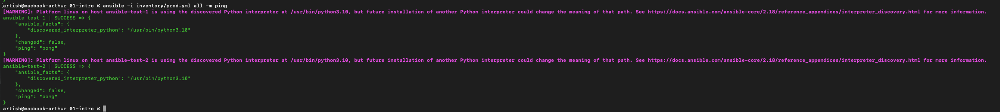

---

## Задание 4

Запустил playbook на prod.yml:
```bash
ansible-playbook -i inventory/prod.yml site.yml
```

Оба хоста показали `some_fact`: `"all default fact"` (используют переменную из group_vars/all).

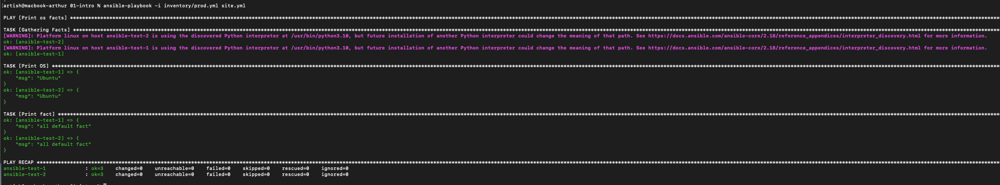

---

## Задание 5

Создал отдельные файлы переменных:
- `group_vars/deb/examp.yml` → `some_fact: "deb default fact"`
- `group_vars/el/examp.yml` → `some_fact: "el default fact"`

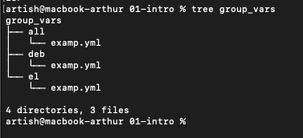

---

## Задание 6

Запустил playbook снова. Каждая группа получила своё значение:
- ansible-test-1 (deb): `"deb default fact"`
- ansible-test-2 (el): `"el default fact"`

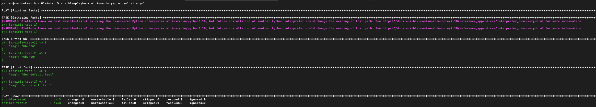

---

## Задание 7

Зашифровал файлы переменных паролем `netology`:
```bash
ansible-vault encrypt group_vars/deb/examp.yml
ansible-vault encrypt group_vars/el/examp.yml
```

Файлы теперь зашифрованы:

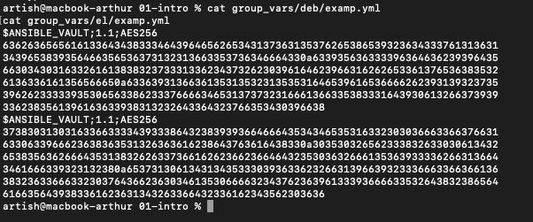

---

## Задание 8

Запустил playbook с запросом пароля vault:
```bash
ansible-playbook -i inventory/prod.yml site.yml --ask-vault-pass
```

Playbook расшифровал переменные и вывел правильные значения для deb и el групп.

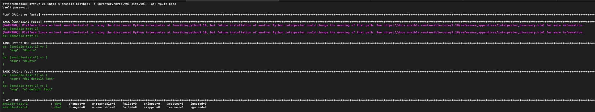

---

## Задание 9

Посмотрел список плагинов подключения:
```bash
ansible-doc -t connection -l
```

Для работы на control node используется плагин `ansible.builtin.local` — выполняет команды локально без SSH.

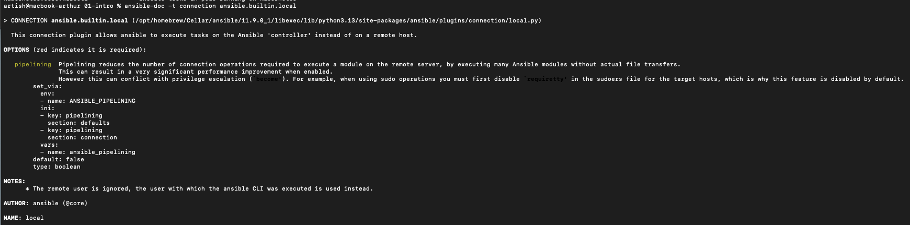

---

## Задание 10

Добавил в `inventory/prod.yml` группу `local` с localhost и создал `group_vars/local/examp.yml` со значением `"local default fact"`.

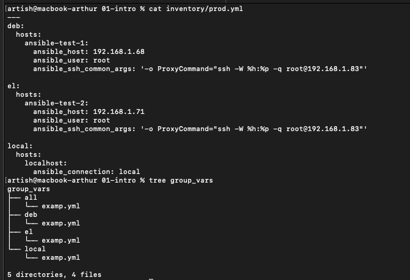

---

## Задание 11

Финальный запуск playbook с vault:
```bash
ansible-playbook -i inventory/prod.yml site.yml --ask-vault-pass
```

Все три группы вывели корректные значения:
- localhost (local): `"local default fact"`
- ansible-test-1 (deb): `"deb default fact"`
- ansible-test-2 (el): `"el default fact"`

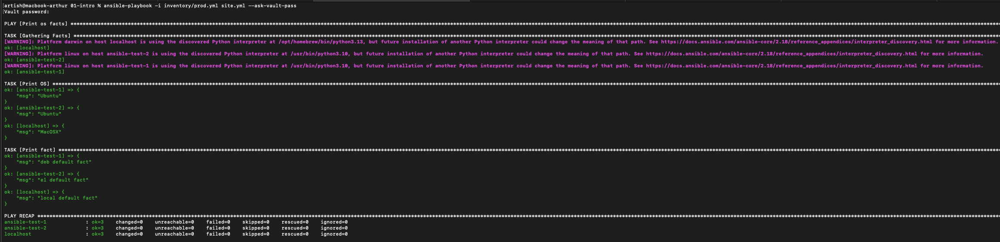

---

## Ответы на вопросы

**Где расположен файл с переменной `some_fact`?**

В `group_vars/all/examp.yml` — для всех хостов.
Плюс создал отдельные файлы для каждой группы: deb, el, local.

**Какой плагин используется для работы на control node?**

`ansible.builtin.local` — для выполнения команд локально на машине где запущен Ansible.

**Зачем нужен ansible-vault?**

Для шифрования секретов (пароли, токены) чтобы их можно было безопасно хранить в git.

---
