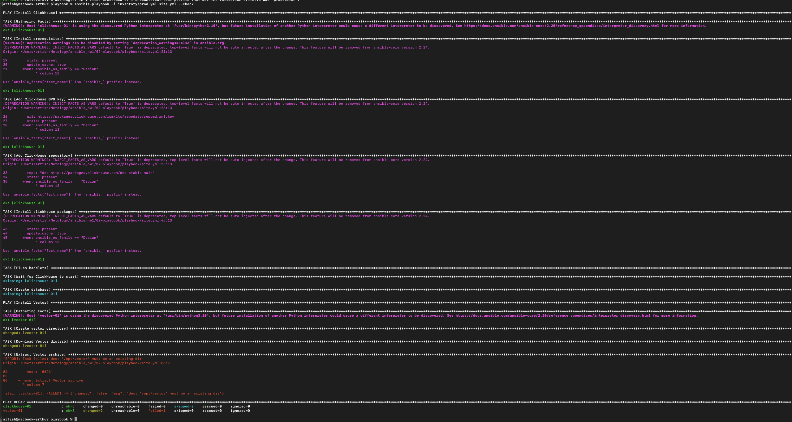
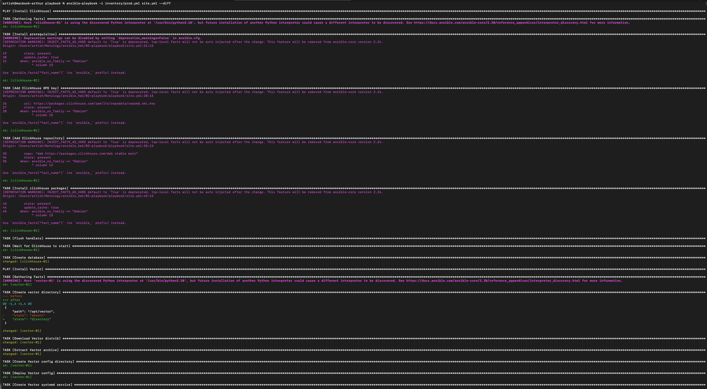
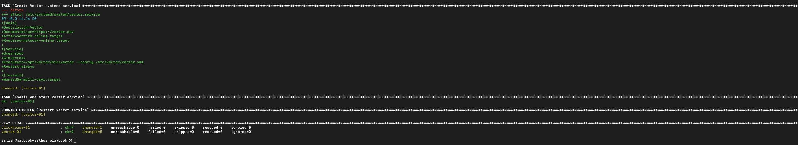
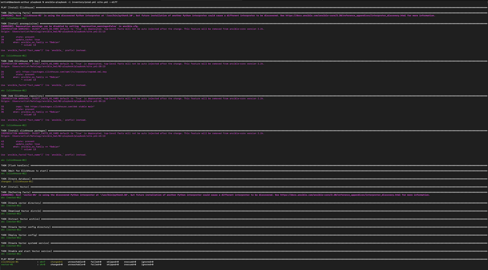
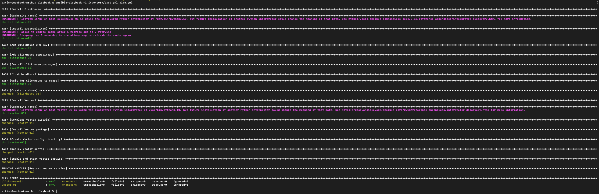
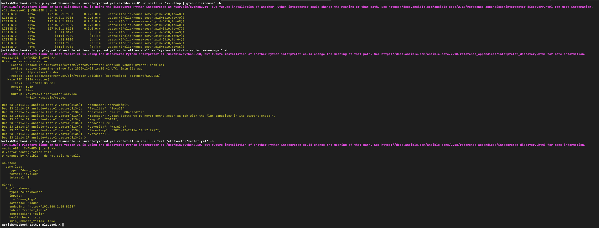

# Домашнее задание к занятию 2 «Работа с Playbook»

---

## Что делает playbook

Playbook устанавливает стек для работы с логами:
- **ClickHouse** — база данных для хранения логов
- **Vector** — агент который собирает логи и отправляет их в ClickHouse

---

## Inventory

Используются две группы хостов в `inventory/prod.yml`:

**clickhouse** — хост для ClickHouse сервера
**vector** — хост для Vector агента

В моём случае это LXC контейнеры в Proxmox:
- clickhouse-01: 192.168.1.68
- vector-01: 192.168.1.71

---

## Переменные

**ClickHouse** — версия ставится из репозитория автоматически последняя stable.

**Vector** (`group_vars/vector/vars.yml`):
- `vector_version: "0.41.1"` — какую версию ставить
- `vector_install_dir: "/opt/vector"` — куда распаковать
- `vector_config_dir: "/etc/vector"` — где хранить конфиг
- `vector_config` — настройки sources (откуда брать логи) и sinks (куда отправлять)

---

## Как работает playbook

### Play 1: Установка ClickHouse

1. Добавляет официальный репозиторий ClickHouse
2. Устанавливает пакеты clickhouse-server и clickhouse-client
3. Запускает сервис
4. Создаёт базу данных `logs`

### Play 2: Установка Vector

1. Скачивает tar.gz архив с Vector нужной версии
2. Распаковывает в `/opt/vector`
3. Создаёт конфиг из Jinja2 template
4. Создаёт systemd service для автозапуска
5. Запускает Vector

Если что-то меняется (конфиг, версия) — сервисы автоматически перезапускаются через handlers.

---

## Запуск

**Проверка синтаксиса:**
```bash
ansible-playbook -i inventory/prod.yml site.yml --syntax-check
```

**Проверка линтером:**
```bash
ansible-lint site.yml
```

**Dry-run (ничего не меняет, только показывает что будет сделано):**
```bash
ansible-playbook -i inventory/prod.yml site.yml --check
```

**Запуск с показом изменений:**
```bash
ansible-playbook -i inventory/prod.yml site.yml --diff
```

**Обычный запуск:**
```bash
ansible-playbook -i inventory/prod.yml site.yml
```

---

## Идемпотентность

Playbook идемпотентен — можно запускать много раз, он не будет ничего менять если всё уже настроено. Проверено повторным запуском с `--diff` — все задачи вернули `ok` без изменений.

---

## Скриншоты

**Check mode (dry-run):**



**Первый запуск с --diff:**





**Повторный запуск (идемпотентность):**



**Полный запуск playbook:**



**Проверка что сервисы работают:**



---

## Окружение

- Control node: macOS
- Managed hosts: LXC контейнеры на Proxmox (Ubuntu 22.04)
- Ansible: 2.10+

---
