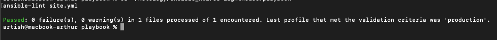
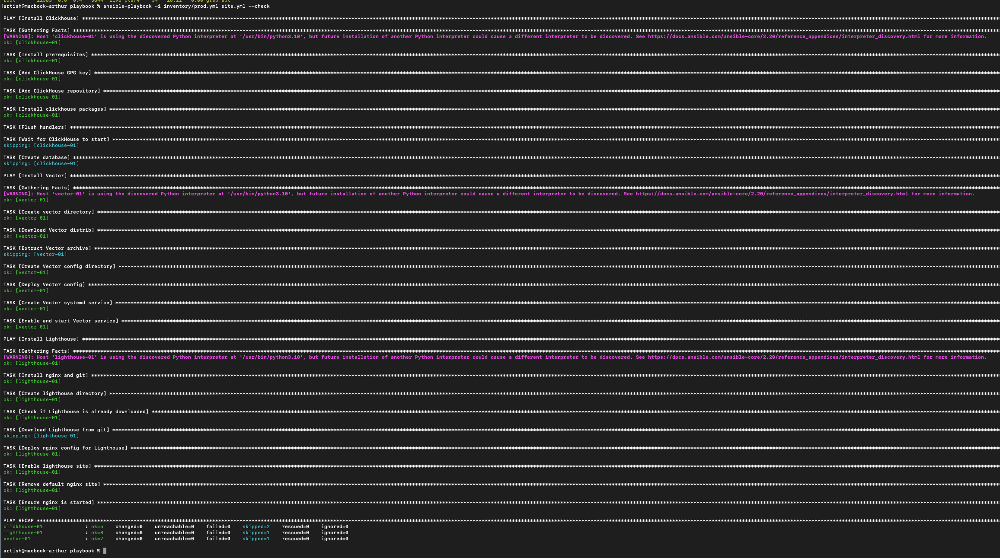
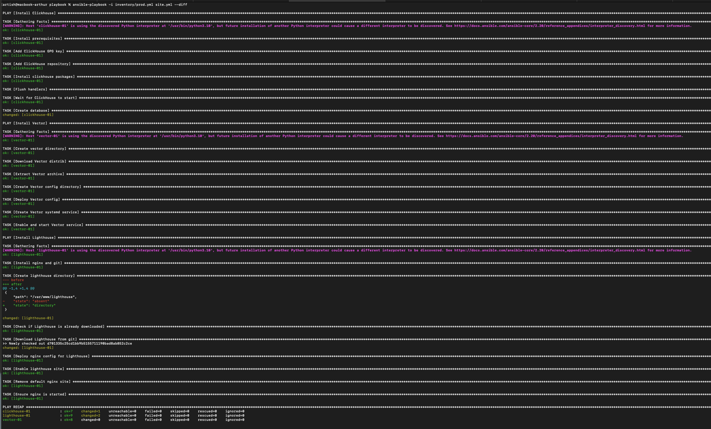
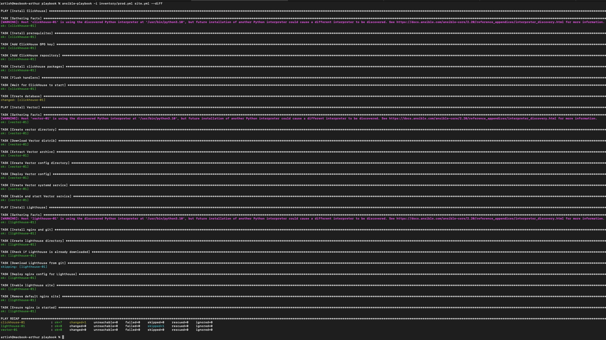

# Домашнее задание к занятию 3 «Использование Ansible»

---

## Что делает playbook

Playbook разворачивает полный стек для работы с логами:
- **ClickHouse** — база данных для хранения логов
- **Vector** — агент для сбора и отправки логов в ClickHouse
- **Lighthouse** — веб-интерфейс для просмотра данных из ClickHouse

---

## Inventory

Три группы хостов в `inventory/prod.yml`:

**clickhouse** — хост для ClickHouse сервера
**vector** — хост для Vector агента
**lighthouse** — хост для Lighthouse веб-интерфейса

В моём случае это LXC контейнеры в Proxmox:
- clickhouse-01: 192.168.1.68
- vector-01: 192.168.1.71
- lighthouse-01: 192.168.1.51

---

## Переменные

**ClickHouse** — версия ставится из репозитория автоматически.

**Vector** (`group_vars/vector/vars.yml`):
- `vector_version: "0.41.1"` — версия Vector
- `vector_install_dir: "/opt/vector"` — директория установки
- `vector_config_dir: "/etc/vector"` — директория конфигов
- `vector_config` — настройки sources и sinks

**Lighthouse** (`group_vars/lighthouse/vars.yml`):
- `lighthouse_repo` — URL git репозитория VKCOM/lighthouse
- `lighthouse_dir: "/var/www/lighthouse"` — куда клонировать
- `lighthouse_port: 80` — порт nginx
- `clickhouse_host` — IP адрес ClickHouse сервера

---

## Как работает playbook

### Play 1: Установка ClickHouse

1. Добавляет репозиторий ClickHouse
2. Устанавливает пакеты
3. Запускает сервис
4. Создаёт базу данных `logs`

### Play 2: Установка Vector

1. Скачивает tar.gz архив Vector
2. Распаковывает в `/opt/vector`
3. Создаёт конфиг из template
4. Создаёт systemd service
5. Запускает Vector

### Play 3: Установка Lighthouse

1. Устанавливает nginx и git
2. Клонирует репозиторий Lighthouse в `/var/www/lighthouse`
3. Создаёт nginx конфиг из template (проксирует API запросы в ClickHouse)
4. Включает сайт, удаляет default
5. Запускает nginx

---

## Запуск

**Проверка синтаксиса:**
```bash
ansible-playbook -i inventory/prod.yml site.yml --syntax-check
```

**Линтер:**
```bash
ansible-lint site.yml
```

**Dry-run:**
```bash
ansible-playbook -i inventory/prod.yml site.yml --check
```

**Применение с показом изменений:**
```bash
ansible-playbook -i inventory/prod.yml site.yml --diff
```

---

## Теги

Playbook не использует теги, выполняется полностью.

---

## Идемпотентность

Playbook идемпотентен — повторный запуск не вносит изменений если всё уже настроено.

---

## Скриншоты

**Ansible-lint:**



**Check mode:**



**Первый запуск:**



**Идемпотентность:**



---

## Окружение

- Control node: macOS
- Managed hosts: LXC контейнеры на Proxmox (Ubuntu 22.04)
- Ansible: 2.10+
- ClickHouse, Vector, Lighthouse

---
