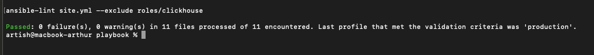
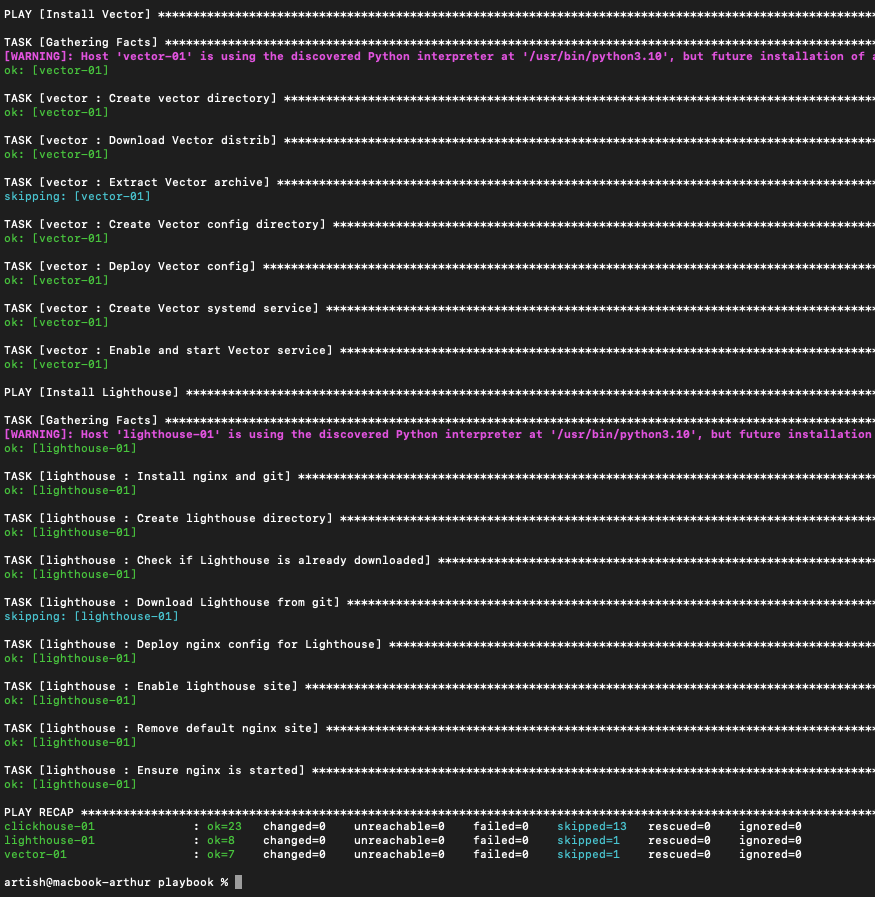
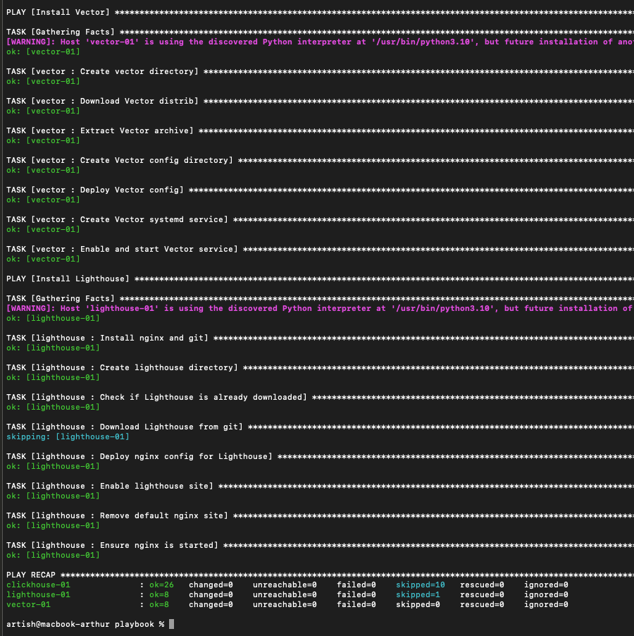

# Домашнее задание к занятию 4 «Работа с roles»

---

## Описание

Playbook разбит на три отдельные роли:
- **clickhouse** — внешняя роль от AlexeySetevoi для установки ClickHouse
- **vector** — своя роль для установки Vector
- **lighthouse** — своя роль для установки Lighthouse + Nginx

## Репозитории ролей

- [vector-role](https://github.com/artharthur/vector-role) — v1.0.1
- [lighthouse-role](https://github.com/artharthur/lighthouse-role) — v1.0.1
- [ansible-clickhouse](https://github.com/AlexeySetevoi/ansible-clickhouse) — v1.13 (внешняя)

## Установка ролей
```bash
ansible-galaxy install -r requirements.yml -p roles
```

## Inventory

Три группы хостов в `inventory/prod.yml`:
- **clickhouse** — сервер ClickHouse
- **vector** — сервер Vector
- **lighthouse** — сервер Lighthouse

## Запуск
```bash
# Проверка синтаксиса
ansible-playbook -i inventory/prod.yml site.yml --syntax-check

# Линтер (исключая внешнюю роль)
ansible-lint site.yml --exclude roles/clickhouse

# Dry-run
ansible-playbook -i inventory/prod.yml site.yml --check

# Применение
ansible-playbook -i inventory/prod.yml site.yml --diff
```

## Переменные

Общие переменные в `group_vars/all/vars.yml`:
- `clickhouse_host` — IP адрес сервера ClickHouse

## Скриншоты

**Ansible-lint:**



**Check mode:**



**Запуск с --diff:**


**Идемпотентность:**



---
