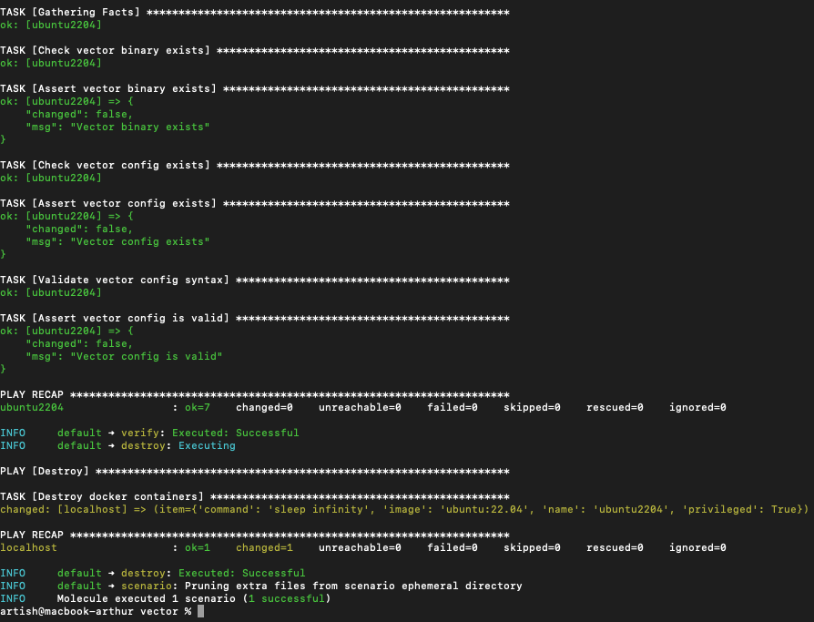
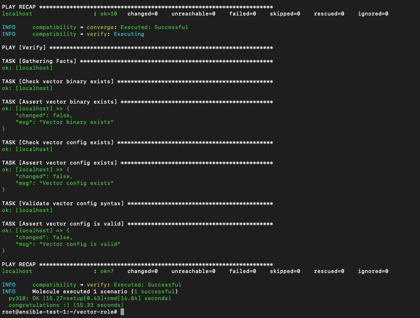

# Домашнее задание к занятию 5 «Тестирование roles»

---

## Описание

Настроено тестирование роли vector-role с помощью Molecule и Tox.

## Что сделано

- Добавлен сценарий Molecule default для тестирования в Docker
- Добавлен сценарий compatibility для тестирования на разных дистрибутивах
- Настроен Tox для автоматизации запуска тестов
- Написаны verify-тесты с проверкой бинарника и конфига Vector

## Репозиторий роли

- [vector-role](https://github.com/artharthur/vector-role)
  - Тег 1.1.0 — добавлен Molecule (сценарий default)
  - Тег 1.2.0 — добавлен Tox и сценарий compatibility

## Molecule

Сценарий default использует Docker с образом Ubuntu 22.04. Тесты проверяют:
- Наличие бинарника Vector
- Валидность конфигурации
```bash
cd vector-role
molecule test
```

## Tox

Автоматизирует запуск Molecule на разных окружениях:
```bash
cd vector-role
tox
```

## Скриншоты

**Molecule test:**



**Tox:**



---
