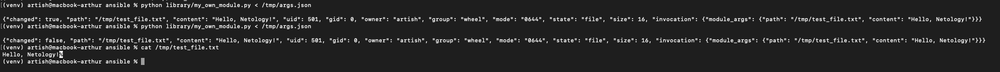
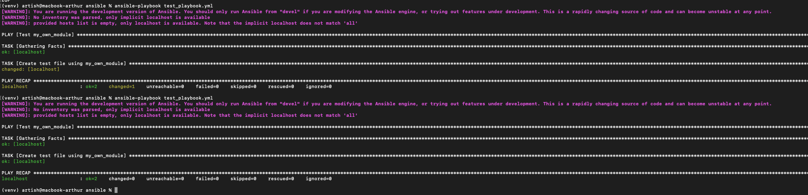
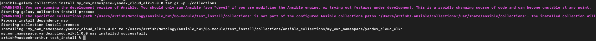
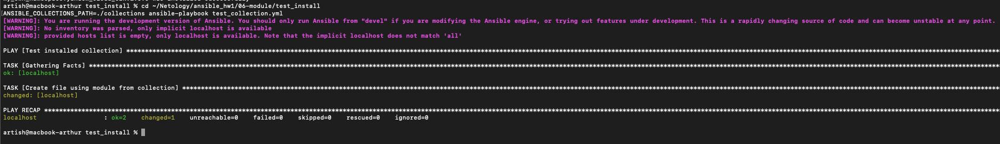

# Домашнее задание к занятию 6 «Создание собственных модулей»

---

## Описание

Написал собственный Ansible модуль `my_own_module`, который создаёт текстовый файл на удалённом хосте. Модуль принимает два параметра: `path` (путь к файлу) и `content` (содержимое). Реализована идемпотентность — если файл уже существует с нужным содержимым, модуль ничего не меняет.

Модуль упакован в коллекцию `my_own_namespace.yandex_cloud_elk` вместе с ролью `create_file`, которая является обёрткой над модулем.

## Репозиторий коллекции

- [my_own_collection](https://github.com/artharthur/my_own_collection)
- [Архив коллекции](https://github.com/artharthur/my_own_collection/blob/main/my_own_namespace-yandex_cloud_elk-1.0.0.tar.gz)

## Установка
```bash
ansible-galaxy collection install my_own_namespace-yandex_cloud_elk-1.0.0.tar.gz
```

## Использование
```yaml
- name: Create file
  my_own_namespace.yandex_cloud_elk.my_own_module:
    path: /tmp/test.txt
    content: "Hello, World!"
```

## Скриншоты

**Шаг 4 — тест модуля локально:**



**Шаг 6 — проверка идемпотентности:**



**Шаг 15 — установка коллекции из архива:**



**Шаг 16 — запуск playbook:**



---
